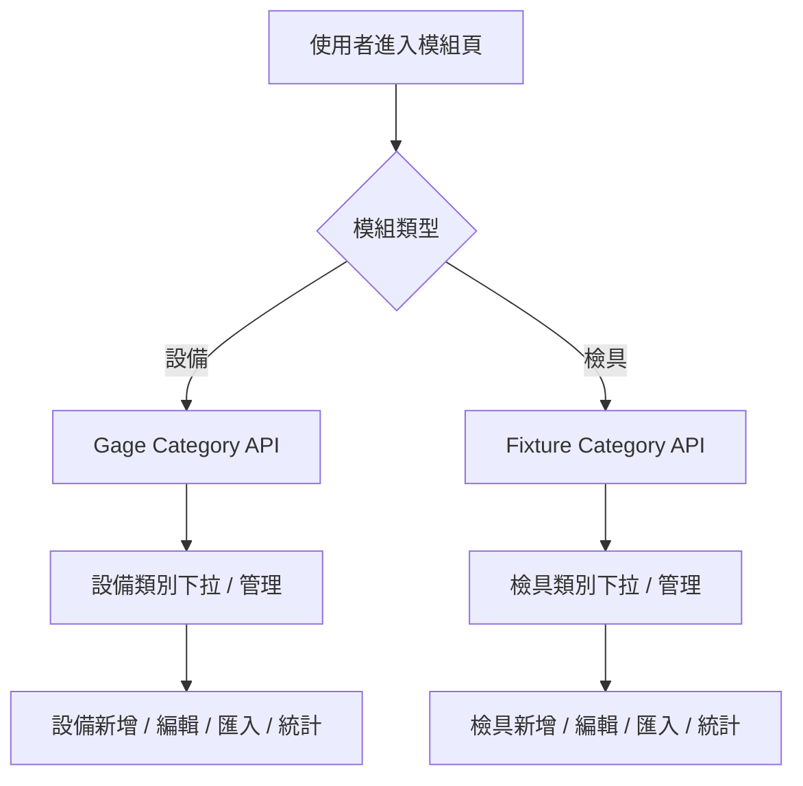

# 檢具類別獨立化規格書

## 1. 問題重述
檢具模組應只顯示與管理「檢具專用類別」，不能混入設備類別或其他資產類別。

## 2. 根源分析
目前系統的分類命名空間未完全隔離，導致：
- 檢具與設備可能共用類別來源
- 前端下拉選單與分類管理會互相污染
- 匯入、統計、編輯與刪除容易跨模組影響

本質上是資料模型與 UI 邊界沒有分開。

## 3. 目標
- 檢具只看見檢具類別
- 設備只看見設備類別
- 兩套類別可各自 CRUD
- 匯入 / 匯出 / 統計都依模組分流

## 4. 建議方案

### 4.1 資料模型
採用方案 A，建立兩套獨立類別表：

- `GageCategory`
  - 只服務設備 / 儀器模組
- `FixtureCategory`
  - 只服務檢具模組

資產關聯方式：
- `Gage.categoryId -> GageCategory.id`
- `Fixture.categoryId -> FixtureCategory.id`

若短期需要兼容舊資料，可暫時保留字串欄位 `category`，但新流程應以 `categoryId` 為準。

### 4.2 服務層切分
將分類服務分成兩套：

- `CategoryService`
  - 設備類別專用
- `FixtureCategoryService`
  - 檢具類別專用

對應 action 也分開：
- 設備側：`createCategoryAction`, `updateCategoryAction`, `deleteCategoryAction`
- 檢具側：`createFixtureCategoryAction`, `updateFixtureCategoryAction`, `deleteFixtureCategoryAction`

### 4.3 前端頁面切分
建立兩個獨立管理頁：

- 設備類別管理頁
- 檢具類別管理頁

規則：
- 檢具頁面只撈 `FixtureCategory`
- 設備頁面只撈 `GageCategory`
- UI 不可共用同一份類別列表

### 4.4 匯入 / 匯出規則
分流原則：
- 設備匯入：只解析設備類別
- 檢具匯入：只解析檢具類別

禁止：
- 用同一個分類解析器同時處理兩個模組
- 匯入檢具資料時自動帶入設備類別

### 4.5 統計規則
統計來源分開：
- 設備數量只統計 `Gage`
- 檢具數量只統計 `Fixture`
- 類別的數量統計只能來自對應模組

## 5. Mermaid 流程圖

## 6. API 規格

### 6.1 設備類別 API
- `GET /api/categories/gage`
- `POST /api/categories/gage`
- `PATCH /api/categories/gage/:id`
- `DELETE /api/categories/gage/:id`

### 6.2 檢具類別 API
- `GET /api/categories/fixture`
- `POST /api/categories/fixture`
- `PATCH /api/categories/fixture/:id`
- `DELETE /api/categories/fixture/:id`

### 6.3 回傳原則
每個 API 只回傳對應模組的類別資料，不得混用。

## 7. 資料遷移建議

### 7.1 遷移步驟
1. 新增 `FixtureCategory`
2. 將現有檢具資料中的字串類別對應到 `FixtureCategory`
3. 回填 `Fixture.categoryId`
4. 檢具頁改讀 `FixtureCategory`
5. 確認穩定後再逐步淘汰舊字串欄位

### 7.2 舊資料相容
- 舊資料可暫時保留顯示
- 新增 / 編輯 / 匯入必須走新關聯欄位

## 8. 驗收條件

- 檢具類別管理只能看到檢具類別
- 設備類別管理只能看到設備類別
- 檢具新增 / 編輯時，看不到設備類別
- 設備新增 / 編輯時，看不到檢具類別
- 檢具匯入不會影響設備類別
- 設備匯入不會影響檢具類別
- 統計數字與對應模組資料一致

## 9. 風險點

- 若只改前端不改資料模型，未來仍會混用
- 若只新增 `type` 欄位但不強制過濾，仍可能誤選
- 舊資料遷移若沒有對應規則，可能造成分類缺失

## 10. 建議執行順序
1. 先新增 `FixtureCategory`
2. 再拆檢具類別 API / service
3. 再改檢具頁面的分類來源
4. 再改匯入 / 匯出
5. 最後做舊資料遷移與驗證
